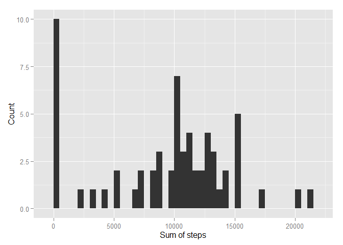
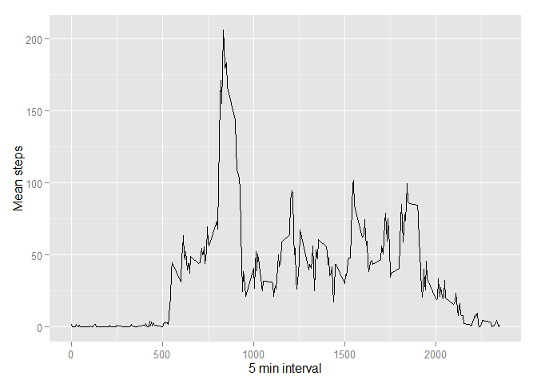
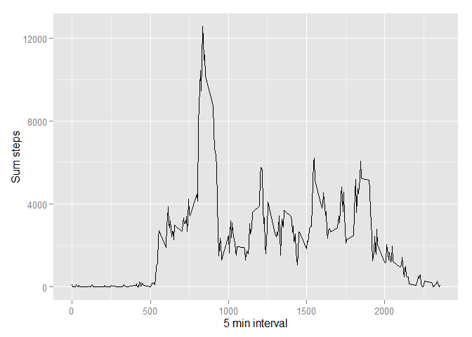
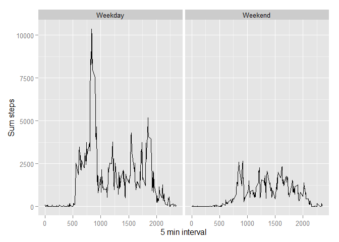

# Reproducible Research: Peer Assessment 1


It is now possible to collect a large amount of data about personal movement using activity monitoring devices such as a Fitbit, Nike Fuelband, or Jawbone Up. These type of devices are part of the “quantified self” movement – a group of enthusiasts who take measurements about themselves regularly to improve their health, to find patterns in their behavior, or because they are tech geeks. But these data remain under-utilized both because the raw data are hard to obtain and there is a lack of statistical methods and software for processing and interpreting the data.

This assignment makes use of data from a personal activity monitoring device. This device collects data at 5 minute intervals through out the day. The data consists of two months of data from an anonymous individual collected during the months of October and November, 2012 and include the number of steps taken in 5 minute intervals each day.
  
variables  

1. steps: Number of steps taking in a 5-minute interval (missing values are coded as NA)
2. date: The date on which the measurement was taken in YYYY-MM-DD format
3. interval: Identifier for the 5-minute interval in which measurement was 1.


## Loading and preprocessing the data

```r
data <- read.csv("activity.csv")
data$date <- as.Date(data$date, "%Y-%m-%d")
data$interval_2 <- strptime(gsub("([0-9]{1,2})([0-9]{2})", "\\1:\\2",data$interval), format='%H:%M')
```

## What is mean total number of steps taken per day?

####1. Calculate the total number of steps taken per day


```r
sum.steps <- with(data, aggregate(steps, by=list(date), sum, na.rm=TRUE ))
names(sum.steps) <- c("Date","Sum.Steps")
head(sum.steps)
```

```
##         Date Sum.Steps
## 1 2012-10-01         0
## 2 2012-10-02       126
## 3 2012-10-03     11352
## 4 2012-10-04     12116
## 5 2012-10-05     13294
## 6 2012-10-06     15420
```
####2. Make a histogram of the total number of steps taken each day


```r
library(ggplot2)
```

```
## Warning: package 'ggplot2' was built under R version 3.2.2
```

```r
ggplot(sum.steps, aes(x=Sum.Steps))  + geom_histogram(binwidth=500) + xlab("Sum of steps") + ylab("Count")
```

 

####3. Calculate and report the mean and median of the total number of steps taken per day


```r
mean(sum.steps$Sum.Steps)
```

```
## [1] 9354.23
```

```r
median(sum.steps$Sum.Steps)
```

```
## [1] 10395
```
## What is the average daily activity pattern?

average.steps <- aggregate(x=list(avg.steps=data$steps), by=list(interval=data$interval), FUN=mean, na.rm=TRUE)

####1. Make a time series plot 

```r
average.steps <- aggregate(x=list(avg.steps=data$steps), by=list(interval=data$interval), FUN=mean, na.rm=TRUE)
tsPlot <- ggplot(average.steps, aes(interval, avg.steps) ) + geom_line()
tsplot <- tsPlot + ggtitle("Time series plot of the 5-minute interval (x-axis) and the average number of steps")
tsPlot <- tsPlot + xlab("5 min interval")
tsPlot <- tsPlot + ylab("Mean steps")
print(tsPlot)
```

 
####Which 5-minute interval, on average across all the days in the dataset, contains the maximum number of steps?

```r
with(average.steps,average.steps[ avg.steps == max(avg.steps), ]  )$avg.steps
```

```
## [1] 206.1698
```

## Imputing missing values

####Calculate and report the total number of missing values in the dataset 

```r
sum(is.na(data$steps))
```

```
## [1] 2304
```
####Devise a strategy for filling in all of the missing values in the dataset.

The mean for that 5-minute interval will be used to fill in the missing value.

####Create a new dataset that is equal to the original dataset but with the missing data filled in.


```r
average.steps <- aggregate(x=list(avg.steps=data$steps), by=list(interval=data$interval), FUN=mean, na.rm=TRUE)

replace.na.step <- function(old.data, averages)
{
    new.data <- old.data
    for (i in 1:nrow(old.data)) {
        if (is.na(old.data$steps[i])) {
            id_match <- which(new.data$interval[i] == averages$interval)
            new.data$steps[i] <- averages[id_match,2]
        }
    }
    new.data
}


new.data <-  replace.na.step(data,average.steps)
head(new.data)
```

```
##       steps       date interval interval_2
## 1 1.7169811 2012-10-01        0       <NA>
## 2 0.3396226 2012-10-01        5       <NA>
## 3 0.1320755 2012-10-01       10       <NA>
## 4 0.1509434 2012-10-01       15       <NA>
## 5 0.0754717 2012-10-01       20       <NA>
## 6 2.0943396 2012-10-01       25       <NA>
```

####Make a histogram of the total number of steps taken each day - after the missing values were inputted 


```r
total.steps <- aggregate(x=list(Sum.Steps=new.data$steps), by=list(interval=new.data$interval), FUN=sum, na.rm=TRUE)
tsPlot <- ggplot(total.steps, aes(interval, Sum.Steps) ) + geom_line()
tsplot <- tsPlot + ggtitle("Time series plot of the 5-minute interval (x-axis) and the average number of steps")
tsPlot <- tsPlot + xlab("5 min interval")
tsPlot <- tsPlot + ylab("Sum steps")
print(tsPlot)
```

 
#### Calculate and report the mean and median total number of steps taken per day - after the missing value were inputted 

```r
mean(total.steps$Sum.Steps)
```

```
## [1] 2280.339
```

```r
median(total.steps$Sum.Steps)
```

```
## [1] 2080.906
```

###Are there differences in activity patterns between weekdays and weekends?

####Create a new factor variable in the dataset with two levels

```r
Sys.setlocale("LC_TIME", "English")
```

```
## [1] "English_United States.1252"
```

```r
day.find <- function(days){
    week.ends <- c("Saturday","Sunday") 
    day_vect <- character(length(days))
    for (i in 1:NROW(days)){
        this.day <- as.character(days[i])
        result <- "Weekday"
        if (weekdays(as.Date(this.day)) %in% week.ends ){
            result <- "Weekend"
        }
        day_vect[i] <- result
    }
    day_vect
}

new.data$day.type <- as.factor(day.find(new.data$date))
str(new.data)
```

```
## 'data.frame':	17568 obs. of  5 variables:
##  $ steps     : num  1.717 0.3396 0.1321 0.1509 0.0755 ...
##  $ date      : Date, format: "2012-10-01" "2012-10-01" ...
##  $ interval  : int  0 5 10 15 20 25 30 35 40 45 ...
##  $ interval_2: POSIXlt, format: NA NA ...
##  $ day.type  : Factor w/ 2 levels "Weekday","Weekend": 1 1 1 1 1 1 1 1 1 1 ...
```

####Make a panel plot containing a time series plot of the 5-minute interval and the average number of steps taken


```r
total.steps <- aggregate(steps ~ interval + day.type  , new.data,FUN=sum, na.rm=TRUE)
tsPlot <- ggplot(total.steps, aes(interval, steps) ) + geom_line()
tsPlot <- tsPlot + facet_grid( . ~ day.type)
tsplot <- tsPlot + ggtitle("Time series plot of the 5-minute interval (x-axis) and the average number of steps")
tsPlot <- tsPlot + xlab("5 min interval")
tsPlot <- tsPlot + ylab("Sum steps")
print(tsPlot)
```

 


